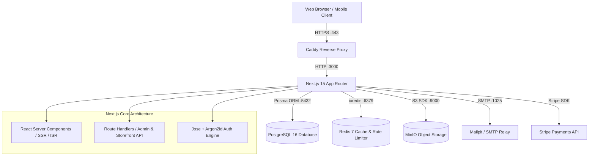
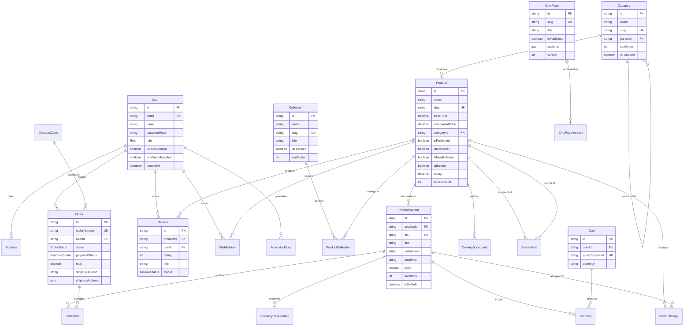

# System Architecture & Entity Relationship Diagram (ARCHITECTURE.md)

This document provides a high-level overview of the **AUREN Carry Goods** architecture, service orchestration, and relational database schema.

---

## 1. High-Level System Architecture



---

## 2. Entity Relationship Diagram (ERD)



---

## 3. Directory Structure

```
new-ecom/
├── .github/
│   ├── workflows/ci.yml       # Automated GitHub Actions CI
│   └── dependabot.yml         # Automated dependency audits
├── prisma/
│   ├── schema.prisma          # PostgreSQL relational schema
│   └── seed.ts                # 40+ products, categories, collections seed
├── src/
│   ├── app/
│   │   ├── globals.css        # CSS variables, design tokens, typography
│   │   ├── layout.tsx         # Root layout with brand typography & providers
│   │   └── page.tsx           # Storefront root page
│   ├── components/
│   │   ├── brand/
│   │   │   └── Logo.tsx       # Vector SVG brand logo & wordmark
│   │   └── ui/
│   │       ├── Button.tsx     # Reusable button with variants
│   │       ├── Badge.tsx      # Status & promotional pills
│   │       ├── Input.tsx      # Form inputs with accessible labels
│   │       ├── Container.tsx  # Responsive layout wrapper
│   │       ├── Modal.tsx      # Accessible modal dialogue
│   │       └── Drawer.tsx     # Slide-out drawer for cart & mobile nav
│   ├── lib/
│   │   ├── auth/
│   │   │   ├── password.ts    # Argon2id password hashing
│   │   │   ├── jwt.ts         # Jose JWT session tokens
│   │   │   ├── rbac.ts        # Role hierarchy & permissions
│   │   │   └── session.ts     # Cookie-based session extraction
│   │   ├── constants/
│   │   │   └── brand.ts       # Brand identity, currencies, contact
│   │   ├── prisma.ts          # Singleton Prisma client
│   │   ├── redis.ts           # Redis client & rate limiter with fallback
│   │   └── utils.ts           # Formatting & class merging helpers
├── tests/
│   └── phase1.test.ts         # Phase 1 unit & security tests
├── Caddyfile                  # Automatic HTTPS reverse proxy config
├── docker-compose.yml         # Postgres, Redis, MinIO, Mailpit, App, Caddy
├── Dockerfile                 # Multi-stage production container
├── .env.example               # Complete environment variable blueprint
├── DECISIONS.md               # Technical decisions and rationale
├── ARCHITECTURE.md            # Architecture & ERD documentation
└── SECURITY.md                # Security model and mitigations
```
